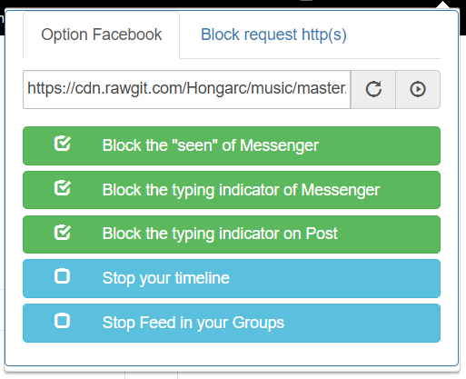

## Utils [](https://travis-ci.org/Hongarc/Utils)

### Before installing
```
yarn global add gulp
```
or
```
npm install gulp -g
```
and make sure that all module installation was successful.

### How to build?
```
yarn run gulp
```
or
```
npm run gulp
```
or simple
```
gulp
```

### How to use?
* Open chrome://extensions/.
* Tick "Developer mode" > "Load unpacked extension".
* Choose "build" folder.
* Done!!!

### Feature
* Don't show seen and typing of messenger (on/off).
* Block request http with patterns (on/off and easy to import and export).
* Change default ringtone facebook call.

### Screenshots
Facebook block options | Block request http(s)
:---------------------:|:---------------------:
 | ")
